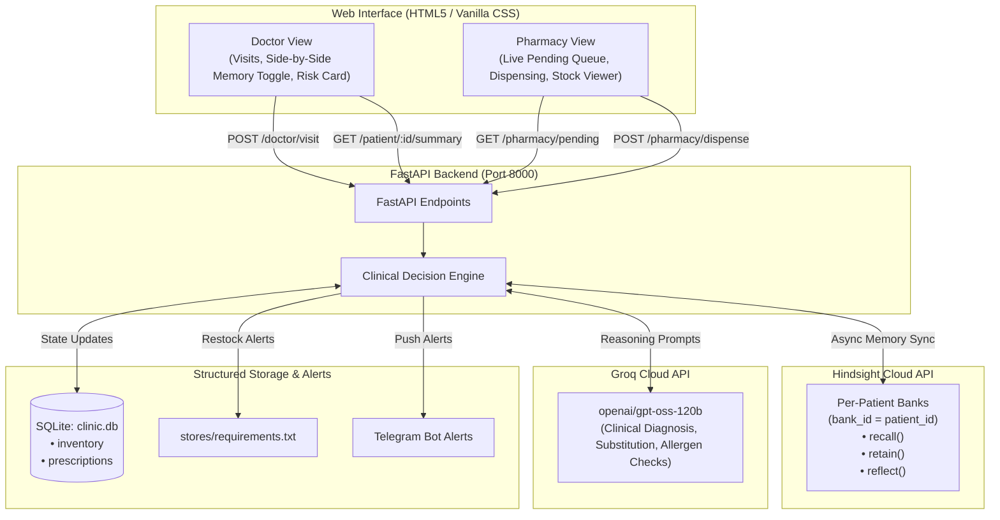

# 🏥 Family Clinic Memory Assistant

> **AI-Powered Clinic & Pharmacy Assistant with Continuity of Care, powered by Hindsight Memory and Groq LLM.**

A family runs a clinic and pharmacy together: one sibling is the doctor, the other manages the pharmacy, and their father oversees pharmacy operations. A patient's complete history follows them from the doctor's desk straight to the pharmacy counter with digital prescriptions, stock-aware dispensing, and automatic alternative suggestions.

---

## 🌟 Key Features

### 1. Doctor Desk
- **Continuous Patient Memory (Hindsight)**: Recalls complete longitudinal patient history across visits (diagnoses, previous regimens, lab trends, allergies).
- **Graceful Onboarding**: Automatically initializes a dedicated memory bank (`bank_id = patient_id`) for new patients.
- **AI Clinical Reasoning (Groq `openai/gpt-oss-120b`)**: Contextual diagnosis and prescription suggestions referencing prior visits.
- **Module 1 — Allergy & Interaction Checking**: Recalls patient allergies and current medications; flags conflicts with a high-priority red warning banner.
- **Module 2 — With / Without Memory Toggle**: Run the same clinical encounter with or without past memory to evaluate differential AI decision-making side-by-side.
- **Module 3 — Patient Risk Profile (`hindsight.reflect`)**: Uses Hindsight synthesis to generate longitudinal risk summaries, recurring patterns, and chronic disease trends.

### 2. Pharmacy Counter
- **Real-Time Prescription Queue**: Pulls pending prescriptions directly from the doctor's desk with zero manual re-entry.
- **Stock-Aware Dispensing**: Automatically checks live SQLite inventory upon dispensing and decrements quantities.
- **Intelligent Drug Substitution**: If an item is out of stock, Groq suggests a therapeutic alternative from available stock in the same drug class.
- **Module 4 — Restock Alerts (File + Telegram)**: If stock drops below threshold, alerts are appended to `stores/requirements.txt` (with duplicate suppression) and pushed via Telegram bot notifications.

---

## 🏗️ Architecture



---

## 📁 Repository Structure

```
├── .env.example              # Template for environment configuration
├── .gitignore                # Security-focused ignore rules (keeps secrets & DB out of git)
├── requirements.txt          # Python dependencies
├── main.py                   # Complete FastAPI application with async Hindsight & Groq
├── static/
│   └── index.html            # Single-page interface (Doctor and Pharmacy views)
├── README.md                 # Project documentation
└── stores/                   # Generated directory for restock requirements (ignored)
```

---

## 🚀 Getting Started

### 1. Clone the repository
```bash
git clone https://github.com/Pranavdeshmukhhh/family-clinic-memory-assistant.git
cd family-clinic-memory-assistant
```

### 2. Install dependencies
```bash
pip install -r requirements.txt
```

### 3. Configure environment variables
Copy the template and fill in your API credentials:
```bash
cp .env.example .env
```

Edit `.env`:
```ini
HINDSIGHT_API_KEY=your_hindsight_api_key_here
HINDSIGHT_BASE_URL=https://api.hindsight.vectorize.io
GROQ_API_KEY=your_groq_api_key_here
TELEGRAM_BOT_TOKEN=your_telegram_bot_token_here
TELEGRAM_CHAT_ID=your_telegram_chat_id_here
```

### 4. Run the application
```bash
python -m uvicorn main:app --host 0.0.0.0 --port 8000 --reload
```

Open **[http://localhost:8000](http://localhost:8000)** in your browser.

---

## 📡 API Endpoints

| Method | Endpoint | Description |
|---|---|---|
| `GET` | `/` | Serves the web interface |
| `POST` | `/doctor/visit` | Submits symptoms, consults memory & Groq, generates pending prescription |
| `GET` | `/pharmacy/pending` | Live queue of pending prescriptions |
| `POST` | `/pharmacy/dispense` | Dispenses prescription, checks inventory, triggers substitution/restock |
| `GET` | `/patient/{patient_id}/summary` | Module 3: Synthesizes risk profile via `hindsight.areflect()` |
| `GET` | `/inventory` | Returns current stock levels and reorder thresholds |

---

## 🔒 Security Best Practices
- **Never commit `.env`**: Protected by `.gitignore`.
- **Database isolation**: Patient transactions and inventories are managed in SQLite, never leaking outside local environments.
- **Dedicated memory banks**: Each patient is siloed in their own Hindsight bank (`bank_id = patient_id`).
