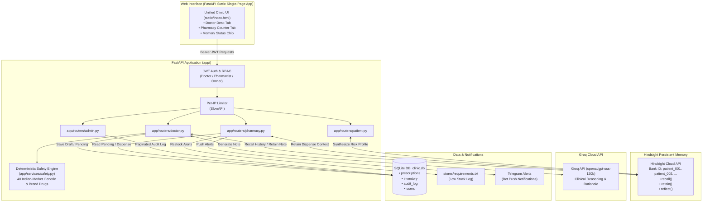

# 🏥 Family Clinic Memory Assistant

[](test_core.py)
[](pyproject.toml)
[](app/main.py)
[](https://vectorize.io)
[](https://groq.com)
[](LICENSE)

> **Demo Video:** [Watch the Walkthrough](https://youtu.be/placeholder) *(demo recording link)*  
> **Interactive App:** [http://localhost:8000](http://localhost:8000)  
> **Swagger API Docs:** [http://localhost:8000/docs](http://localhost:8000/docs)

---

## 📖 The Story

It is a Tuesday evening at a bustling family clinic in Hyderabad. The doctor finishes a consultation, types a prescription, and clicks **Submit**. Next door, at the in-house pharmacy counter, the pharmacist would traditionally have no idea — a crumpled handwritten chit would travel between rooms, or a phone call would interrupt both clinicians mid-task. When stock runs dry, patients wait or are sent elsewhere. When a returning patient with a penicillin allergy comes in for a routine cough, a hurried doctor might not recall an adverse reaction from three years prior.

**Family Clinic Memory Assistant** connects those two rooms through a single, persistent memory of every patient. The **Doctor Desk** and the **Pharmacy Counter** share an integrated backend. Every clinical encounter, every doctor approval, every dispensed medicine, and every substitution is retained in **Hindsight** memory — so the next time that patient walks in, their longitudinal history is already at the clinician's fingertips: past diagnoses, documented allergies, previous regimens, lab trends, and whether past treatments succeeded.

---

## 🌟 Key Features

### 🩺 1. Doctor Desk
- **Continuous Patient Memory (Hindsight)**: Recalls complete longitudinal patient history across visits (diagnoses, prior regimens, lab trends, allergies) scoped per patient bank (`bank_id = patient_id`).
- **Graceful Onboarding**: Automatically initializes a dedicated memory bank for new patients without manual configuration.
- **AI Clinical Reasoning (Groq `openai/gpt-oss-120b`)**: Contextual diagnosis and prescription suggestions referencing past encounters and treatment responses.
- **Deterministic Allergy & Interaction Safety Engine**: Code-based safety layer (`app/services/safety.py`) backed by `data/drug_knowledge.json` covering ~40 common Indian-market drugs, allergen groups, and pairwise drug-drug interactions. **The LLM cannot add, remove, or suppress safety findings.**
- **With / Without Memory Toggle**: Run clinical consultations with memory enabled or disabled to observe differential AI decision-making.
- **Patient Risk Synthesis (`hindsight.reflect`)**: Hindsight synthesizes the patient's full bank into an evolving risk profile and chronic disease summary.
- **Human-in-the-Loop Gate**: The AI only drafts a prescription. The licensed doctor must inspect, edit dosage/medicine if needed, and explicitly approve before anything is queued to the pharmacy.

### 💊 2. Pharmacy Counter
- **Real-Time Prescription Queue**: Instantly pulls approved prescriptions from the doctor's desk (`GET /pharmacy/pending`) with zero manual re-entry.
- **Stock-Aware Dispensing**: Checks real-time SQLite inventory upon dispensing and atomically decrements quantities.
- **Intelligent Drug Substitution**: If a prescribed drug is out of stock, the system suggests therapeutic alternatives in the same drug class from currently available inventory.
- **Automated Restock Alerts**: Low-stock events append to `stores/requirements.txt` (with duplicate suppression) and can push instant Telegram bot notifications.

### 🔐 3. Security, RBAC & Auditability
- **Role-Based Access Control (RBAC)**: Enforced via FastAPI dependencies across `doctor`, `pharmacist`, and `owner` roles.
- **JWT Authentication**: Secure Bearer tokens with bcrypt password hashing.
- **Immutable Audit Log**: Every login, visit, approval, rejection, dispense, drug substitution, and allergy override is written to `audit_log`.
- **Per-IP Rate Limiting**: Protects authentication (`/auth/login`) and LLM endpoints against brute force and resource exhaustion.
- **Fail-Closed Architecture**: Missing production secrets halt startup unless `DEMO_MODE=true` is explicitly enabled. No stack traces or internal secrets leak to API consumers.

---

## 🧠 How Hindsight Memory Is Used

Hindsight acts as the persistent cognitive bridge across encounters and between the clinic and pharmacy.

```
┌─────────────────────────────────────────────────────────────────────────────────┐
│                                HINDSIGHT CLOUD                                  │
│  Patient Banks: bank_id = "patient_001", "patient_002", "patient_003", ...     │
└────────────▲───────────────────────────────────────────────────────┬────────────┘
             │ retain()                                              │ recall() / reflect()
             │                                                       │
┌────────────┴──────────────────────┐               ┌────────────────▼────────────┐
│           DOCTOR DESK             │               │      PHARMACY COUNTER       │
│ • recall() patient history        │               │ • recall() clinical context │
│ • retain() visit notes            │               │ • retain() dispense records │
│ • retain() approved prescriptions │               │ • decrement stock & alert   │
│ • retain() rejected suggestions   │               │ • intelligent substitution  │
└───────────────────────────────────┘               └─────────────────────────────┘
```

### Operation Mapping

| Operation | Trigger | What is Stored / Retrieved |
|---|---|---|
| **`recall()`** (Encounter) | Start of `/doctor/visit` | Recalls past diagnoses, previous treatments, and symptoms relevant to the presenting complaint. |
| **`recall()`** (Allergies) | Pre-consultation check | Explicitly extracts documented allergy facts to feed the deterministic safety engine. |
| **`retain()`** (Visit Note) | After `/doctor/visit` | Symptoms, clinician notes, and preliminary diagnosis. *(Prescription is NOT retained until doctor approves).* |
| **`retain()`** (Approval) | On `/doctor/approve` | `"Dr approved prescription: <med> <dose>. Sent to pharmacy on <date>."` tagged with context `doctor_approved`. |
| **`retain()`** (Rejection) | On `/doctor/reject` | `"Suggestion rejected by doctor: <med>. Reason: <reason>."` tagged with context `doctor_rejected`. |
| **`retain()`** (Dispense) | On `/pharmacy/dispense`| Dispensed medicine, quantity, and whether a substitution occurred. |
| **`reflect()`** (Risk Profile)| On `/patient/{id}/summary` | Synthesizes bank history into a longitudinal risk summary, chronic trends, and precautions. |

### How the Agent Improves from Visit 1 to Visit 5

| Visit | What the AI Knows (with Memory ON) | What Improves |
|---|---|---|
| **Visit 1** | Fresh bank: *"No prior history, first visit."* | Baseline consultation based solely on presenting complaints. |
| **Visit 2** | Recalls Visit 1 diagnosis, baseline labs, initial medication. | Evaluates treatment efficacy (*"Started Metformin 500mg — fasting glucose dropped from 168 to 148 mg/dL"*). |
| **Visit 3** | Recalls documented Penicillin allergy + past responses. | **Avoids contraindicated drugs** (*Prescribes Azithromycin instead of Amoxicillin for sore throat*). |
| **Visit 4** | Understands chronic trajectory over months. | Titrates dosage based on longitudinal lab trends (*"HbA1c steady at 7.1% — maintain current dose"*). |
| **Visit 5** | Identifies multi-visit failure patterns. | Proactively escalates therapy (*"Glycemic control slipping on Metformin alone — add second-line agent"*). |

> **Without Memory:** Every visit is Visit 1. The agent forgets allergies, repeats ineffective therapies, and cannot monitor chronic diseases over time.

---

## 🛡️ Deterministic Safety Layer

Safety cannot depend on LLM prompt adherence. In this system, **safety is enforced in deterministic Python code**:

```
                              [ Doctor Visit Request ]
                                         │
                                         ▼
                      [ Step 1: Recall Patient Allergies ]
                                         │
                                         ▼
                 ┌───────────────────────────────────────────────┐
                 │       DETERMINISTIC SAFETY ENGINE             │
                 │          (app/services/safety.py)             │
                 │  • Normalized Generic & Brand Mapping         │
                 │  • Allergen Group Matching (Penicillin, etc.) │
                 │  • Pairwise Drug-Drug Interactions            │
                 │  • Duplicate Therapy Detection                │
                 └───────────────────────┬───────────────────────┘
                                         │
                 ┌───────────────────────┴───────────────────────┐
                 ▼                                               ▼
         [ Safe / Warning ]                             [ Contraindicated ]
                 │                                               │
                 ▼                                               ▼
        Proceeds to Draft                             Blocks Approval Unless Doctor
                                                      Provides Audited Override Reason
```

1. **Brand & Generic Normalization**: Maps trade names (e.g. *Augmentin*, *Brufen*, *Glycomet*, *Crocin*) to standard generic compounds.
2. **Allergen Group Matching**: If a patient has a documented `"penicillin"` allergy, the engine flags all beta-lactams (*Amoxicillin*, *Ampicillin*, etc.).
3. **Pairwise Drug Interactions**: Evaluates proposed medicines against the patient's active medication list (e.g. *Metformin + Iodinated Contrast*, *Tramadol + Sertraline*).
4. **LLM Explanations Only**: The Groq LLM receives the engine's findings to draft plain-language rationales. It cannot remove, suppress, or bypass any finding.

---

## 👥 Demo User Accounts

When running in `DEMO_MODE=true`, the following accounts are automatically seeded into SQLite:

| Username | Password | Role | Permissions |
|---|---|---|---|
| `doctor_demo` | `demo1234` | `doctor` | Create visits, review safety alerts, approve/reject prescriptions |
| `pharmacist_demo` | `demo1234` | `pharmacist` | View pending prescriptions queue, dispense medicines, stock substitutions |
| `owner_demo` | `demo1234` | `owner` | View clinic analytics, inspect inventory, view full paginated audit log |

---

## 🚀 Quick Start

### 1. Prerequisites
- Python 3.11 or higher
- Git

### 2. Clone and Install
```bash
git clone https://github.com/Pranavdeshmukhhh/family-clinic-memory-assistant.git
cd family-clinic-memory-assistant

# Install dependencies
pip install -r requirements.txt
```

### 3. Environment Configuration

Copy the sample environment file:
```bash
cp .env.example .env
```

#### Option A: Zero-Config Demo Mode (Recommended for quick hackathon evaluation)
No external API keys required!
```bash
# In your .env file or environment:
DEMO_MODE=true
```

#### Option B: Live Cloud Mode (Hindsight + Groq)
Provide your keys in `.env`:
```dotenv
DEMO_MODE=false
HINDSIGHT_API_KEY=your_hindsight_api_key_here
HINDSIGHT_BASE_URL=https://api.hindsight.vectorize.io
GROQ_API_KEY=your_groq_api_key_here
JWT_SECRET=your_random_32_byte_secret_hex
```

### 4. Seed Demo Patients (Multi-Visit Histories)
```bash
python scripts/seed_demo.py
```
This initializes 3 synthetic patients with realistic clinical trajectories:
- **`patient_001` — Ravi Kumar (58M)**: Hypertension + Type 2 Diabetes, documented Penicillin allergy (5 visits).
- **`patient_002` — Lakshmi Devi (45F)**: Type 2 Diabetes + Hypothyroidism, diabetic neuropathy (4 visits).
- **`patient_003` — Arjun Reddy (30M)**: Chronic Migraine, NSAID sensitivity (3 visits).

### 5. Launch the Server
```bash
# Using Python / Uvicorn:
DEMO_MODE=true python -m uvicorn main:app --host 0.0.0.0 --port 8000 --reload

# Or on Windows PowerShell:
$env:DEMO_MODE="true"; python -m uvicorn main:app --host 0.0.0.0 --port 8000 --reload

# Or using Makefile:
make demo
```

Open your browser to:
- **Unified Web Application:** [http://localhost:8000](http://localhost:8000)
- **Interactive OpenAPI Docs:** [http://localhost:8000/docs](http://localhost:8000/docs)

---

## 🎬 3-Minute Demo Walkthrough

### Act 1: The Penicillin Allergy Check (`patient_001` — Ravi Kumar)
1. Navigate to **Doctor Desk** tab on [http://localhost:8000](http://localhost:8000).
2. Select **patient_001 (Ravi Kumar - 58M)** from the dropdown.
3. Keep the **"Use Hindsight memory"** toggle **ON**.
4. Enter symptoms: `sore throat, mild fever for 2 days`.
5. Click **Consult Doctor Desk**.
   - Notice the AI recalls 5 prior visits and the documented Penicillin allergy.
   - If Amoxicillin is considered, the **Deterministic Safety Engine** fires a prominent red alert:
     > 🛑 **CONTRAINDICATED**: Amoxicillin belongs to penicillin class — patient has documented allergy.
   - The AI safely selects or recommends **Azithromycin 500mg**.
6. Click **Approve Prescription** → Status transitions from `draft` to `pending`.

### Act 2: Pharmacy Queue & Stock Dispense
1. Click the **Pharmacy Counter** tab.
2. Notice the approved prescription for Ravi Kumar appears immediately in the live queue.
3. Review stock availability and click **Dispense Medicine**.
4. The inventory is atomically decremented, the prescription is marked fulfilled, and a record is retained in Hindsight.

### Act 3: Contrast — Memory OFF vs Memory ON
1. Return to the **Doctor Desk**.
2. Select `patient_001`, enter the exact same symptoms (`sore throat, mild fever`).
3. Toggle **"Use Hindsight memory"** to **OFF**.
4. Click **Consult Doctor Desk**.
   - Notice the AI treats Ravi as a brand new patient with zero clinical context.
   - Without memory, the doctor loses visibility into historical drug responses and chronic disease trends.

---

## 🏗️ Architecture



---

## 📁 Repository Structure

```
family-clinic-memory-assistant/
├── .env.example              # Documented configuration template
├── .gitignore                # Security-focused ignore rules
├── LICENSE                   # MIT License
├── Makefile                  # Developer targets (run, demo, seed, test, lint)
├── README.md                 # Project documentation
├── pyproject.toml            # Project metadata, dependencies, ruff + mypy config
├── requirements.txt          # Python dependencies
├── main.py                   # Root entrypoint shim (uvicorn main:app)
│
├── app/
│   ├── main.py               # FastAPI app factory, lifespan, CORS, error handlers
│   ├── config.py             # Pydantic Settings with fail-closed startup validation
│   ├── db.py                 # SQLite database schema, inventory seeds, demo users
│   ├── models.py             # Pydantic request/response schemas
│   ├── routers/
│   │   ├── auth.py           # POST /auth/login (JWT generation, rate-limited)
│   │   ├── doctor.py         # POST /doctor/visit, /doctor/approve, /doctor/reject
│   │   ├── pharmacy.py       # GET /pharmacy/pending, POST /pharmacy/dispense
│   │   ├── patient.py        # GET /patient/{id}/summary (Hindsight reflect)
│   │   ├── admin.py          # GET /inventory, GET /patients, GET /admin/audit
│   │   └── health.py         # GET /health (integration status booleans)
│   └── services/
│       ├── memory.py         # Hindsight SDK client (recall, retain, reflect)
│       ├── safety.py         # Deterministic allergy, cross-reactivity & interaction rules
│       ├── llm.py            # Groq LLM integration with graceful offline fallback
│       ├── inventory.py      # SQLite stock management and drug substitutions
│       ├── alerts.py         # File logging and Telegram push notifications
│       ├── audit.py          # Immutable audit log recorder
│       ├── auth.py           # Passlib bcrypt hashing and JWT token verification
│       └── rate_limit.py     # SlowAPI per-IP rate limiter
│
├── data/
│   └── drug_knowledge.json   # 40-drug clinical knowledge base (classes, brands, interactions)
├── scripts/
│   └── seed_demo.py          # Multi-visit clinical history seeder for demo patients
├── static/
│   ├── index.html            # Production responsive single-page clinic & pharmacy UI
│   ├── doctor.html           # Standalone doctor desk view
│   └── pharmacy.html         # Standalone pharmacy counter view
├── tests/
│   ├── conftest.py           # Pytest fixtures and mock client setup
│   ├── test_auth.py          # Authentication and token issuance tests
│   ├── test_doctor.py        # Visit creation and approval flow tests
│   ├── test_pharmacy.py      # Dispensing and inventory decrement tests
│   ├── test_roles.py         # RBAC role enforcement and 401/403 security tests
│   └── test_safety.py        # Deterministic safety rules and interaction tests
└── test_core.py              # Root end-to-end integration test suite
```

---

## 📡 API Endpoints

| Method | Endpoint | Role Required | Description |
|---|---|---|---|
| `POST` | `/auth/login` | *Public* | Authenticate with username and password; returns Bearer JWT. |
| `GET` | `/health` | *Public* | Service health and integration status (booleans only). |
| `POST` | `/doctor/visit` | `doctor` | Recalls memory → runs safety check → calls Groq LLM → saves draft. |
| `POST` | `/doctor/approve` | `doctor` | Approves draft prescription. Blocks on contraindications without override. |
| `POST` | `/doctor/reject` | `doctor` | Rejects draft prescription and retains rejection reason to Hindsight. |
| `GET` | `/pharmacy/pending` | `doctor`, `pharmacist`, `owner` | Lists all approved prescriptions waiting to be dispensed. |
| `POST` | `/pharmacy/dispense` | `pharmacist` | Dispenses prescription, decrements inventory, applies substitutions. |
| `GET` | `/patient/{id}/summary` | `doctor`, `owner` | Triggers Hindsight `reflect()` to synthesize longitudinal risk profile. |
| `GET` | `/patients` | `doctor`, `pharmacist`, `owner` | Lists recent patients with visit counts and last prescribed medication. |
| `GET` | `/inventory` | `doctor`, `pharmacist`, `owner` | Current inventory levels and reorder thresholds. |
| `POST` | `/medicines/alternatives` | `doctor`, `pharmacist` | Therapeutic drug alternatives filtered against live stock. |
| `GET` | `/admin/audit` | `owner` | Paginated immutable audit trail in reverse-chronological order. |

---

## 🧪 Running the Test Suite

The test suite contains **119 automated tests** covering authentication, RBAC authorization, end-to-end clinical workflows, and safety rules:

```bash
# Run all tests:
pytest test_core.py tests/ -v

# Or via Makefile:
make test
```

### Test Breakdown
- **Role-Based Access Control (`tests/test_roles.py`)**: Validates that doctors cannot dispense, pharmacists cannot approve visits, owners cannot create visits, and unauthenticated requests return 401.
- **Deterministic Safety Engine (`tests/test_safety.py`)**: Tests generic-to-brand mapping, penicillin group cross-reactivity, sulfa cross-reactivity, duplicate NSAID/statin detection, and severity ordering.
- **End-to-End Workflow (`test_core.py`)**: Tests visit creation, memory recall, prescription approval, pharmacy queue appearance, and stock deduction.

---

## ⚖️ Clinical & Legal Disclaimer

> **IMPORTANT CLINICAL NOTICE**:  
> Family Clinic Memory Assistant is intended exclusively as a **clinical decision support system**. It does **not** provide medical diagnosis or independently prescribe medications. All prescriptions, dosages, and drug substitutions **must be reviewed, validated, and explicitly approved by a licensed medical practitioner** before being dispensed or administered to any patient. All patient records included in this demo repository are completely synthetic and for demonstration purposes only.
