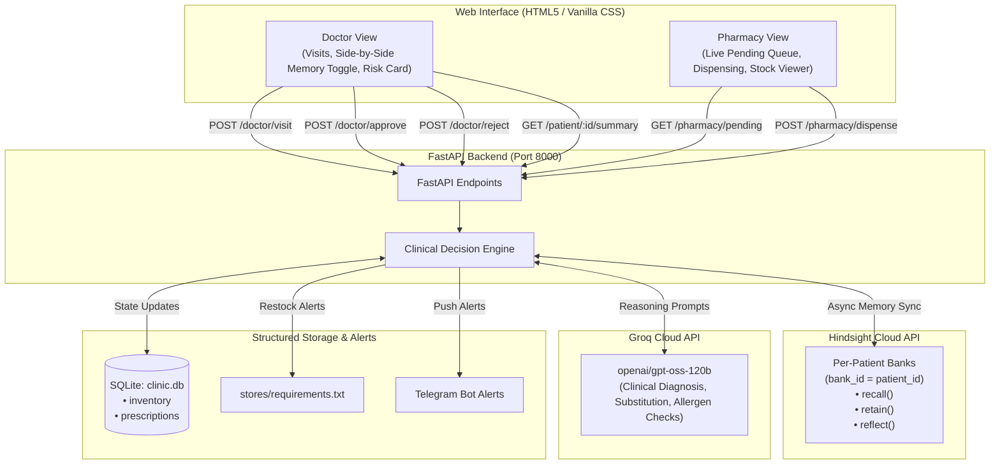

# 🏥 Family Clinic Memory Assistant

> **AI-Powered Clinic & Pharmacy Assistant with Continuity of Care, powered by Hindsight Memory and Groq LLM.**

---

It is a Tuesday evening at a small family-run clinic. The doctor finishes a consultation, types a prescription, and clicks **Submit**. Next door, in the pharmacy, the pharmacist would normally have no idea — a handwritten chit would travel between rooms, or a phone call would interrupt both of them mid-task.

This project connects those two rooms through a single, persistent memory of every patient. The doctor's desk and the pharmacy counter share one backend. Every visit note, every approved prescription, every dispensed medicine is retained in Hindsight — so the next time that patient walks in, their history is already there: their diagnoses, their allergies, what they were last prescribed, and whether it worked.

---

## 🌟 Key Features

### 1. Doctor Desk
- **Continuous Patient Memory (Hindsight)**: Recalls complete longitudinal patient history across visits (diagnoses, previous regimens, lab trends, allergies).
- **Graceful Onboarding**: Automatically initializes a dedicated memory bank (`bank_id = patient_id`) for new patients.
- **AI Clinical Reasoning (Groq `openai/gpt-oss-120b`)**: Contextual diagnosis and prescription suggestions referencing prior visits.
- **Module 1 — Allergy & Interaction Checking**: Recalls patient allergies and current medications; flags conflicts with a high-priority red warning banner.
- **Module 2 — With / Without Memory Toggle**: Run the same clinical encounter with or without past memory to evaluate differential AI decision-making side-by-side.
- **Module 3 — Patient Risk Profile (`hindsight.reflect`)**: Uses Hindsight synthesis to generate longitudinal risk summaries, recurring patterns, and chronic disease trends.
- **Human Approval Gate**: The AI drafts a prescription; the doctor reviews, may edit medicine or dosage, and must explicitly approve before anything reaches the pharmacy.

### 2. Pharmacy Counter
- **Real-Time Prescription Queue**: Pulls pending prescriptions directly from the doctor's desk with zero manual re-entry.
- **Stock-Aware Dispensing**: Automatically checks live SQLite inventory upon dispensing and decrements quantities.
- **Intelligent Drug Substitution**: If an item is out of stock, Groq suggests a therapeutic alternative from available stock in the same drug class.
- **Module 4 — Restock Alerts (File + Telegram)**: If stock drops below threshold, alerts are appended to `stores/requirements.txt` (with duplicate suppression) and pushed via Telegram bot notifications.

---

## 🧠 How Hindsight Memory Is Used

Hindsight is the connective tissue between every interaction in this system. Here is exactly how each operation maps to the Hindsight API:

| Operation | When | What is stored / retrieved |
|-----------|------|---------------------------|
| **`aretain`** — visit notes | After every `/doctor/visit` | Symptoms, doctor notes, AI-suggested diagnosis. The prescription itself is **not** retained until the doctor approves it. |
| **`aretain`** — approval | After `/doctor/approve` | `"Dr approved prescription: <medicine> <dosage>. Sent to pharmacy on <date>."` with context `doctor_approved`. |
| **`aretain`** — rejection | After `/doctor/reject` | `"Suggestion rejected by doctor: <medicine>."` with context `doctor_rejected`. |
| **`aretain`** — dispense | After `/pharmacy/dispense` | What was dispensed, quantity remaining, any substitution made. |
| **`arecall`** — before visit | At the start of `/doctor/visit` | Patient history queried against the presenting symptoms; also a separate allergy recall. |
| **`arecall`** — before dispense | At the start of `/pharmacy/dispense` | Patient context surfaced at the pharmacy counter. |
| **`areflect`** — risk profile | On `/patient/{id}/summary` | Hindsight synthesises the full bank into a longitudinal risk summary. |

**Key design decisions:**
- One Hindsight bank per patient (`bank_id = patient_id`). Banks are isolated — no patient can see another's data.
- Hindsight holds **clinical context only**. Inventory levels and prescription records (including status: `draft` → `pending` → `dispensed`) live in SQLite.
- The **With / Without Memory toggle** (Module 2) runs two parallel calls to `/doctor/visit` — one with `use_memory=true`, one with `use_memory=false` — so you can see on the same case what the AI does without any history.

---

## 🛡️ Safety and Scope

This system is **clinical decision support, not autonomous prescribing**.

- The AI produces a draft. The draft is saved with status `"draft"` and is invisible to the pharmacy.
- The doctor must read the suggestion, optionally edit the medicine name or dosage, and click **Approve** before the prescription changes status to `"pending"` and appears in the pharmacy queue.
- Rejecting a suggestion marks the prescription `"rejected"` and retains a rejection note to Hindsight so future visits know what was tried and discarded.
- Patient memory is isolated per Hindsight bank. No cross-patient recall is possible by design.
- All patient data in this demo is **fully synthetic**. No real clinical data was used at any point.

---

## 🚧 Known Limitations

- **No authentication**: There is no login, session management, or role separation. Anyone with network access to port 8000 can use either interface. This is a demo, not a production system.
- **LLM output is parsed but not schema-validated**: Groq responses are parsed as JSON with a fallback rule engine. The parsed fields are used directly without a formal schema validator. Malformed or unexpected model output may degrade gracefully rather than fail explicitly.
- **Single SQLite file**: `clinic.db` is a local file. There is no replication, backup, or migration tooling.
- **No audit log**: Approved, rejected, and dispensed events are retained to Hindsight and logged to the console, but there is no structured, tamper-evident audit trail.

---

## 🎬 Demo Walkthrough

Three seed patients are created automatically on startup. Each demonstrates a distinct scenario:

### patient_001 — Rajesh Kumar, 54 (Returning patient, allergy present)
1. Open **Doctor's Desk** → click `patient_001` in the demo panel or the patient strip.
2. Enter symptoms such as *"elevated fasting glucose, fatigue"*.
3. Submit — the AI recalls two prior visits (August and September 2026) and notes the **penicillin allergy**.
4. If the AI suggests Amoxicillin, a **red allergy warning banner** fires immediately.
5. The draft card appears. Edit the medicine if needed, then click **Approve & Send to Pharmacy**.
6. Switch to **Pharmacy Counter** — the prescription appears in the queue. Click **Dispense**.

### patient_002 — Meera Iyer, 29 (Returning patient, low stock scenario)
1. Enter `patient_002` in the doctor form.
2. Submit with symptoms like *"headache, high blood pressure"*.
3. The AI recalls her prior hypertension visit (September 2026) and is likely to suggest Lisinopril.
4. Approve the prescription → go to Pharmacy.
5. Lisinopril has low seed stock (qty 6, threshold 10). After dispensing, a **restock alert** triggers and stock drops to 5.

### patient_003 — (New patient, no history)
1. Enter `patient_003` — this bank exists but has no retained memories.
2. Submit any symptoms.
3. The **"No prior history — first visit"** message appears in the memory panel.
4. The AI reasons from symptoms alone, with no history context. Approve and dispense normally.

> **Tip:** Use the **⚡ Compare Memory Effect** button with `patient_001` to run two simultaneous consultations — one with full history, one without — and see how the prescriptions differ.

---

## 🏗️ Architecture



---

## 📁 Repository Structure

```
├── .env.example              # Template for environment configuration
├── .gitignore                # Security-focused ignore rules (keeps secrets & DB out of git)
├── requirements.txt          # Python dependencies
├── main.py                   # Complete FastAPI application with async Hindsight & Groq
├── static/
│   ├── index.html            # Landing page
│   ├── doctor.html           # Doctor's Desk interface
│   └── pharmacy.html         # Pharmacy Counter interface
├── README.md                 # Project documentation
└── stores/                   # Generated directory for restock requirements (ignored)
```

---

## 🚀 Getting Started

### 1. Clone the repository
```bash
git clone https://github.com/Pranavdeshmukhhh/family-clinic-memory-assistant.git
cd family-clinic-memory-assistant
```

### 2. Install dependencies
```bash
pip install -r requirements.txt
```

### 3. Configure environment variables
Copy the template and fill in your API credentials:
```bash
cp .env.example .env
```

Edit `.env`:
```ini
HINDSIGHT_API_KEY=your_hindsight_api_key_here
HINDSIGHT_BASE_URL=https://api.hindsight.vectorize.io
GROQ_API_KEY=your_groq_api_key_here
TELEGRAM_BOT_TOKEN=your_telegram_bot_token_here
TELEGRAM_CHAT_ID=your_telegram_chat_id_here
```

### 4. Run the application
```bash
python -m uvicorn main:app --host 0.0.0.0 --port 8000 --reload
```

Open **[http://localhost:8000](http://localhost:8000)** in your browser.

---

## 📡 API Endpoints

| Method | Endpoint | Description |
|---|---|---|
| `GET` | `/` | Landing page |
| `GET` | `/doctor` | Doctor's Desk UI |
| `GET` | `/pharmacy` | Pharmacy Counter UI |
| `POST` | `/doctor/visit` | Submits symptoms, consults memory & Groq, saves as draft prescription |
| `POST` | `/doctor/approve` | Doctor approves (optionally edits) draft → status becomes `pending` |
| `POST` | `/doctor/reject` | Doctor rejects draft → status becomes `rejected` |
| `GET` | `/pharmacy/pending` | Live queue of doctor-approved prescriptions only |
| `POST` | `/pharmacy/dispense` | Dispenses prescription, checks inventory, triggers substitution/restock |
| `GET` | `/patient/{patient_id}/summary` | Synthesises risk profile via `hindsight.areflect()` |
| `GET` | `/inventory` | Returns current stock levels and reorder thresholds |
| `POST` | `/medicines/alternatives` | AI-ranked alternative medicines checked against live stock |
| `GET` | `/patients` | Recent patient list for the patient strip |

---

## 🔒 Security Best Practices
- **Never commit `.env`**: Protected by `.gitignore`.
- **Database isolation**: Patient transactions and inventories are managed in SQLite, never leaking outside local environments.
- **Dedicated memory banks**: Each patient is siloed in their own Hindsight bank (`bank_id = patient_id`).
- **No secrets in logs**: API keys and tokens are never printed or logged, even on error paths.
