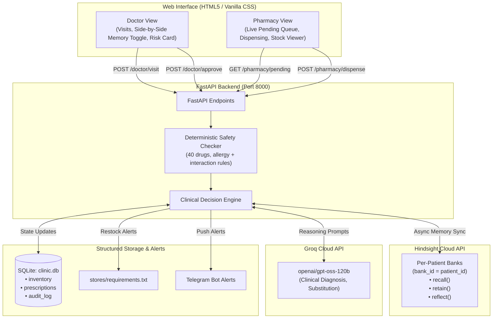

# 🏥 Family Clinic Memory Assistant

> **Demo video: \<link\>**

> **AI-Powered Clinic & Pharmacy Assistant with Continuity of Care, powered by Hindsight Memory and Groq LLM.**

---

It is a Tuesday evening at a small family-run clinic. The doctor finishes a consultation, types a prescription, and clicks **Submit**. Next door, in the pharmacy, the pharmacist would normally have no idea — a handwritten chit would travel between rooms, or a phone call would interrupt both of them mid-task.

This project connects those two rooms through a single, persistent memory of every patient. The doctor's desk and the pharmacy counter share one backend. Every visit note, every approved prescription, every dispensed medicine is retained in Hindsight — so the next time that patient walks in, their history is already there: their diagnoses, their allergies, what they were last prescribed, and whether it worked.

---

## 🌟 Key Features

### 1. Doctor Desk
- **Continuous Patient Memory (Hindsight)**: Recalls complete longitudinal patient history across visits (diagnoses, previous regimens, lab trends, allergies).
- **Graceful Onboarding**: Automatically initializes a dedicated memory bank (`bank_id = patient_id`) for new patients.
- **AI Clinical Reasoning (Groq `openai/gpt-oss-120b`)**: Contextual diagnosis and prescription suggestions referencing prior visits.
- **Deterministic Allergy & Interaction Checker**: Code-based safety layer — 40 drugs, cross-reactivity, interactions, duplicate therapy. The LLM cannot override safety findings.
- **With / Without Memory Toggle**: Run the same clinical encounter with or without past memory to evaluate differential AI decision-making side-by-side.
- **Patient Risk Profile (`hindsight.reflect`)**: Hindsight synthesis to generate longitudinal risk summaries, recurring patterns, and chronic disease trends.
- **Human Approval Gate**: The AI drafts a prescription; the doctor reviews, may edit medicine or dosage, and must explicitly approve before anything reaches the pharmacy.

### 2. Pharmacy Counter
- **Real-Time Prescription Queue**: Pulls pending prescriptions directly from the doctor's desk with zero manual re-entry.
- **Stock-Aware Dispensing**: Automatically checks live SQLite inventory upon dispensing and decrements quantities.
- **Intelligent Drug Substitution**: If an item is out of stock, the system suggests a therapeutic alternative from available stock in the same drug class.
- **Restock Alerts (File + Telegram)**: If stock drops below threshold, alerts are appended to `stores/requirements.txt` (with duplicate suppression) and pushed via Telegram bot notifications.

---

## 🧠 How Hindsight Memory Is Used

Hindsight is the connective tissue between every interaction in this system. Here is exactly how each operation maps to the Hindsight API:

| Operation | When | What is stored / retrieved |
|-----------|------|---------------------------|
| **`retain()`** — visit notes | After every `/doctor/visit` | Symptoms, doctor notes, AI-suggested diagnosis. The prescription itself is **not** retained until the doctor approves it. |
| **`retain()`** — approval | After `/doctor/approve` | `"Dr approved prescription: <medicine> <dosage>. Sent to pharmacy on <date>."` with context `doctor_approved`. |
| **`retain()`** — rejection | After `/doctor/reject` | `"Suggestion rejected by doctor: <medicine>."` with context `doctor_rejected`. |
| **`retain()`** — dispense | After `/pharmacy/dispense` | What was dispensed, quantity remaining, any substitution made. |
| **`recall()`** — before visit | At the start of `/doctor/visit` | Patient history queried against the presenting symptoms; also a separate allergy recall. |
| **`recall()`** — before dispense | At the start of `/pharmacy/dispense` | Patient context surfaced at the pharmacy counter. |
| **`reflect()`** — risk profile | On `/patient/{id}/summary` | Hindsight synthesises the full bank into a longitudinal risk summary. |

### Key design decisions
- **One Hindsight bank per patient** (`bank_id = patient_id`). Banks are isolated — no patient can see another's data.
- Hindsight holds **clinical context only**. Inventory levels and prescription records (including status: `draft` → `pending` → `dispensed`) live in SQLite.
- The **With / Without Memory toggle** runs the same symptoms through `/doctor/visit` twice — once with `use_memory=true`, once with `use_memory=false` — so you can see on the same case what the AI does without any history.

### How the agent improves from Visit 1 to Visit 5

| Visit | What the AI knows (with memory ON) | What improves |
|-------|-----------------------------------|---------------|
| **Visit 1** | Nothing — "No prior history, first visit." | Generic diagnosis from symptoms alone. |
| **Visit 2** | Recalls Visit 1 diagnosis, prescribed drugs, lab values. | References prior treatment ("Patient was started on Metformin 500mg — fasting glucose improved from 168 to 148.") |
| **Visit 3** | Recalls both previous visits + documented allergy. | **Avoids contraindicated drugs** (e.g., skips Amoxicillin for a penicillin-allergic patient with sore throat, prescribes Azithromycin instead). |
| **Visit 4** | Full longitudinal trend: labs improving, medications stable. | Adjusts dosing based on trends ("HbA1c improved from 7.8% to 7.1% — continue current regimen"). |
| **Visit 5** | Recognises worsening pattern (e.g., glucose rising again). | Proactively escalates ("Glycemic control slipping despite Metformin 500mg BD — increase to 1000mg BD"). |

**Without memory**, every visit is Visit 1. The AI cannot reference allergies, track lab trends, or build on past decisions.

### Concrete before/after example

**Patient: Ravi Kumar, 58M. Presenting: "sore throat, mild fever."**

| | Without Memory | With Memory |
|---|---|---|
| **History** | "No prior history — first visit." | "Recalled 5 prior visits. Type 2 Diabetes on Metformin 1000mg BD + Amlodipine 5mg + Atorvastatin 10mg. **Penicillin allergy documented (hives after Amoxicillin, 2018).**" |
| **Diagnosis** | "Upper Respiratory Tract Infection" | "Viral pharyngitis in context of diabetes — monitor glucose during illness" |
| **Prescription** | "Amoxicillin 250mg TDS × 5 days" | "Azithromycin 500mg OD × 3 days (penicillin allergy — avoided Amoxicillin)" |
| **Safety** | ❌ No allergy flag (AI has no history) | ✅ **Deterministic allergy check blocks Amoxicillin** even if LLM makes a mistake |

---

## 🛡️ Safety and Scope

This system is **clinical decision support, not autonomous prescribing**.

- The AI produces a draft. The draft is saved with status `"draft"` and is invisible to the pharmacy.
- The doctor must read the suggestion, optionally edit the medicine name or dosage, and click **Approve** before the prescription changes status to `"pending"` and appears in the pharmacy queue.
- **Deterministic safety checker** (`app/services/safety.py`) runs on every visit BEFORE the LLM and again at approval time. It checks allergies, cross-reactivity (e.g., penicillin → cephalosporin), drug-drug interactions, and duplicate therapy. The LLM cannot add or remove safety findings.
- **Contraindicated findings block approval** unless the doctor provides a written `override_reason`, which is stored in the audit log.
- Rejecting a suggestion marks the prescription `"rejected"` and retains a rejection note to Hindsight so future visits know what was tried and discarded.
- Patient memory is isolated per Hindsight bank. No cross-patient recall is possible by design.
- All patient data in this demo is **fully synthetic**. No real clinical data was used at any point.

> ⚠️ **Disclaimer**: This is decision support only. A licensed doctor must review every prescription before it reaches a patient.

---

## 🚧 Known Limitations

- **Single-user demo**: Authentication and role separation (doctor/pharmacist/owner) exist in code but the demo UI uses pre-configured demo tokens. This is not a multi-tenant production system.
- **LLM output is parsed but not schema-validated**: Groq responses are parsed as JSON with a fallback rule engine. Malformed model output degrades gracefully.
- **Single SQLite file**: `clinic.db` is a local file. There is no replication, backup, or migration tooling.
- **Drug knowledge base**: The safety checker covers ~40 common Indian-market drugs. Drugs not in the knowledge base produce a warning, not silence, but coverage is not exhaustive.
- **No real patient data**: All names, histories, and lab values are synthetic.
- **Decision support only**: The AI assists; a licensed clinician must always review and approve.

---

## 🚀 Quick Start

### 1. Clone and install
```bash
git clone https://github.com/Pranavdeshmukhhh/family-clinic-memory-assistant.git
cd family-clinic-memory-assistant
pip install -r requirements.txt
```

### 2. Configure environment
```bash
cp .env.example .env
# Edit .env with your API keys, OR set DEMO_MODE=true to run without keys
```

### 3. Seed demo patients
```bash
python scripts/seed_demo.py
```
This creates 3 patients with realistic multi-visit histories:
- **patient_001 — Ravi Kumar** (58M, hypertension + diabetes, penicillin allergy, 5 visits)
- **patient_002 — Lakshmi Devi** (45F, type 2 diabetes + hypothyroidism, 4 visits)
- **patient_003 — Arjun Reddy** (30M, recurring migraine, NSAID sensitivity, 3 visits)

### 4. Run the app
```bash
python -m uvicorn main:app --host 0.0.0.0 --port 8000 --reload
```

Open **[http://localhost:8000](http://localhost:8000)** in your browser.

---

## 🎬 Demo Walkthrough

### patient_001 — Ravi Kumar, 58 (Returning patient, penicillin allergy)
1. Open **Doctor's Desk** → enter `patient_001`, symptoms: *"sore throat, mild fever"*.
2. Submit — the AI recalls 5 prior visits, the penicillin allergy, and the diabetes history.
3. If the AI suggests Amoxicillin, the **deterministic allergy checker** fires a red warning.
4. Approve (or edit) → switch to **Pharmacy Counter** → dispense.

### patient_002 — Lakshmi Devi, 45 (Diabetes + neuropathy)
1. Enter `patient_002`, symptoms: *"tingling in feet, fatigue"*.
2. The AI recalls 4 prior visits, the HbA1c trend, and prior Pregabalin prescription.
3. Approve and dispense.

### patient_003 — Arjun Reddy, 30 (Migraine, NSAID sensitivity)
1. Enter `patient_003`, symptoms: *"severe headache, nausea"*.
2. The AI recalls migraine history and Propranolol regimen, avoids NSAIDs.

> **Tip:** Use the **⚡ Compare Memory Effect** button to run two simultaneous consultations — one with full history, one without — and see how the prescriptions differ.

---

## 🏗️ Architecture



---

## 📁 Repository Structure

```
├── .env.example              # Template for environment configuration
├── .gitignore                # Security-focused ignore rules
├── LICENSE                   # MIT License
├── README.md                 # This file
├── requirements.txt          # Python dependencies
├── main.py                   # Uvicorn entry point
├── app/
│   ├── main.py               # FastAPI app factory, routers, middleware
│   ├── config.py             # Pydantic settings (fail-closed)
│   ├── db.py                 # SQLite connection, migrations, schema
│   ├── models.py             # Pydantic request/response schemas
│   ├── routers/              # doctor, pharmacy, patient, admin, auth, health
│   └── services/             # memory, llm, safety, inventory, alerts, audit, auth
├── data/
│   └── drug_knowledge.json   # 40-drug safety knowledge base
├── scripts/
│   └── seed_demo.py          # Seed 3 patients with realistic histories
├── static/                   # HTML/CSS/JS frontend
├── tests/                    # pytest test suite (114+ tests)
└── pyproject.toml            # ruff + mypy config
```

---

## 📡 API Endpoints

| Method | Endpoint | Description |
|---|---|---|
| `POST` | `/auth/login` | JWT login (doctor, pharmacist, owner roles) |
| `POST` | `/doctor/visit` | Recall memory → safety check → LLM diagnosis → save draft |
| `POST` | `/doctor/approve` | Doctor approves (blocks on contraindicated without override) |
| `POST` | `/doctor/reject` | Doctor rejects draft |
| `GET` | `/pharmacy/pending` | Doctor-approved prescriptions waiting for dispensing |
| `POST` | `/pharmacy/dispense` | Dispense, decrement stock, substitution if needed |
| `GET` | `/patient/{id}/summary` | Hindsight `reflect()` — longitudinal risk profile |
| `GET` | `/inventory` | Current stock levels and reorder thresholds |
| `GET` | `/admin/audit` | Paginated audit log (owner only) |
| `GET` | `/health` | Service health check |

---

## 🔒 Security
- `.env` is in `.gitignore` — never committed.
- JWT authentication with bcrypt password hashing.
- Role-based access control (doctor / pharmacist / owner).
- Per-IP rate limiting on login and LLM endpoints.
- Generic error messages — no stack traces leak to clients.
- Patient memory isolated per Hindsight bank — no cross-patient recall.
- Deterministic safety checker runs independently of the LLM.
- All critical actions written to audit log.

---

## 📜 License

MIT — see [LICENSE](LICENSE).
